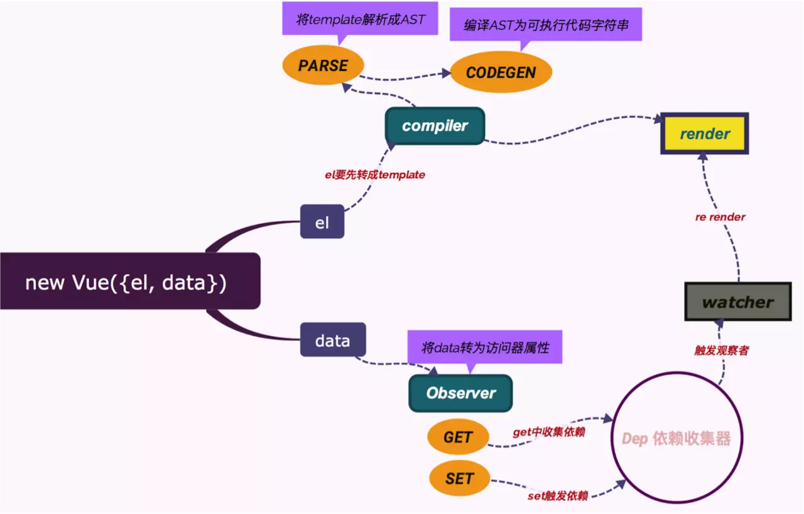

### 实现 Vue 简单的响应式系统

#### 响应式系统


> 代码部分仅实现 data 对象的响应式更新，整个部分的逻辑如上图所示。

#### 核心方法
> 该响应式实现的核心方法为 `Object.defineProperty()`，语法为：

```JS
/**
 * obj          要在其上定义属性的对象。
 * prop         要定义或修改的属性的名称。
 * descriptor   将被定义或修改的属性描述符。
 * @returns     被传递给函数的对象。
 */
Object.defineProperty(obj, prop, descriptor);
```

#### 发布订阅模式